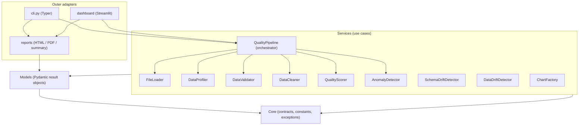
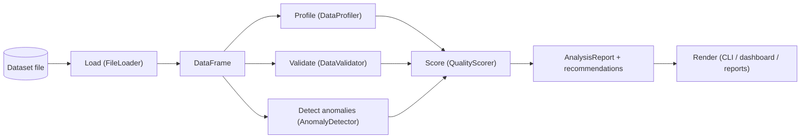

# Architecture

The Smart Data Quality Monitoring System is built on Clean Architecture. The codebase is divided
into concentric layers, and a single rule governs how they may reference one another: **source-code
dependencies point inward only.** Nothing in an inner layer knows anything about an outer one, so
the domain can be reasoned about, tested, and reused independently of how it is delivered (CLI,
dashboard, or reports).

## Layers

From innermost to outermost:

1. **Core (`dqms.core`)** — the domain centre. It holds constants and enumerations
   (`FileFormat`, `Severity`, `QualityDimension`, `AnomalyMethod`), the exception hierarchy rooted
   at `DataQualityError`, and the abstract contracts (`DataLoader`, `DataExporter`,
   `AnalysisComponent`). It depends on nothing inside the package.

2. **Models (`dqms.models`)** — immutable Pydantic result objects: `DatasetProfile`,
   `ValidationReport`, `QualityScore`, `AnomalyReport`, the drift reports, and the aggregate
   `AnalysisReport`. Models depend only on core.

3. **Configuration (`dqms.config`)** — strongly-typed, layered settings built with
   `pydantic-settings`. Settings are validated at load time and injected into services.

4. **Services (`dqms.services`)** — the use cases. Each service performs one job and returns a
   model: `FileLoader`, `DataProfiler`, `DataValidator`, `DataCleaner`, `QualityScorer`,
   `AnomalyDetector`, `SchemaDriftDetector`, `DataDriftDetector`, and `ChartFactory` (visualizer).
   The `QualityPipeline` orchestrator composes them into the analysis flow. Services depend on core,
   models, config, and the utility helpers.

5. **Outer adapters** — delivery mechanisms that depend inward on the services and never the other
   way round:
   - **CLI (`dqms.cli`)** — a thin Typer adapter that parses arguments, invokes the pipeline, and
     renders results with Rich.
   - **Dashboard (`dqms.dashboard`)** — a Streamlit presentation layer that reuses the same
     pipeline as the CLI.
   - **Reports (`dqms.reports`)** — HTML/PDF/summary rendering of an `AnalysisReport`.

Cross-cutting **utilities (`dqms.utils`)** — security, safe IO, logging, regex patterns, and timing
— sit alongside the services and are consumed by the layers that need them without introducing
inward dependencies.

## The dependency rule

Every arrow points toward the centre. The outer adapters know about the services; the services know
about the models; the models know about core. No arrow ever runs the other way, which is what keeps
the domain independent of any particular interface.

## Pipeline data flow

`QualityPipeline.analyze` runs the analysis in a fixed order. Each stage consumes the raw frame (or
the output of an earlier stage) and produces an immutable model; the orchestrator assembles them
into one `AnalysisReport` and derives prioritised recommendations.

The load stage is the trust boundary: security checks (path resolution, size limit, extension
allow-list, symlink refusal) run before any data is read. Profiling, validation, and anomaly
detection are independent of one another and all feed the scorer, which combines their outputs into
the weighted quality score. Anomaly detection is optional and can be skipped (`--no-anomalies`) when
only the deterministic checks are needed.

## Design principles in practice

**SOLID**

- *Single responsibility* — each service does exactly one thing (loading, profiling, validating,
  and so on), and each validation and cleaning rule is a small, self-contained method.
- *Open/closed* — the validator and cleaner are extended by adding a rule method and registering it,
  never by editing existing rules. New file formats are added by extending the extension map and
  reader dispatch rather than rewriting the loader.
- *Liskov substitution* — analysis services share the `AnalysisComponent` base and are
  interchangeable from the orchestrator's point of view.
- *Interface segregation* — `DataLoader` and `DataExporter` are narrow protocols describing a single
  capability each, so implementers are never forced to depend on methods they do not use.
- *Dependency inversion* — outer layers depend on the abstractions in `core`, and services receive
  their `Settings` by injection rather than reaching for globals.

**DRY** — orchestration lives only in `QualityPipeline`, so the CLI and dashboard never duplicate
it; the profile is computed once and reused by the scorer, reports, and dashboard; and shared regex
predicates live in a single `utils.patterns` module used by both the validator and the cleaner.

**KISS** — the quality score is a transparent weighted average with per-dimension explanations
rather than an opaque model; readers auto-detect format and encoding but fall back to simple, safe
defaults; and each stage returns a plain, serialisable result object.

## Component responsibilities

| Component | Layer | Responsibility |
| --- | --- | --- |
| `core.constants` | Core | Enumerations and shared constants (formats, severities, dimensions, formula-injection prefixes) |
| `core.exceptions` | Core | `DataQualityError` hierarchy carrying message and structured details |
| `core.interfaces` | Core | `DataLoader`/`DataExporter` protocols and the `AnalysisComponent` base |
| `config.settings` | Config | Layered, Pydantic-validated settings (defaults, YAML, env vars, `.env`) |
| `models.*` | Models | Immutable result objects for profile, validation, quality, anomaly, drift, and report |
| `services.loader` | Services | Secure, multi-format loading with encoding detection and chunked reads |
| `services.profiler` | Services | Per-column and dataset-level descriptive statistics |
| `services.validator` | Services | Rule battery producing a structured `ValidationReport` |
| `services.cleaner` | Services | Ordered, auditable cleaning transformations |
| `services.scorer` | Services | Weighted, explainable five-dimension quality score |
| `services.anomaly` | Services | Z-score, IQR, and Isolation Forest anomaly detection |
| `services.schema_drift` | Services | Structural (column/dtype) comparison between datasets |
| `services.data_drift` | Services | PSI, KS test, moment and correlation drift comparison |
| `services.visualizer` | Services | Matplotlib chart generation (Agg backend) |
| `services.orchestrator` | Services | Composes services into the pipeline; builds recommendations |
| `utils.security` | Utils | Path resolution, size/extension/symlink checks, formula neutralisation |
| `utils.io` | Utils | Safe, format-aware DataFrame export |
| `utils.logging` | Utils | Idempotent Loguru configuration and component-bound loggers |
| `utils.patterns` | Utils | Shared email/phone/identifier regexes and column-hint matching |
| `reports.generator` | Reports | Render `AnalysisReport` to HTML, PDF, and text |
| `dashboard.app` | Dashboard | Streamlit presentation over the shared pipeline |
| `cli` | CLI | Typer command surface and Rich rendering |
